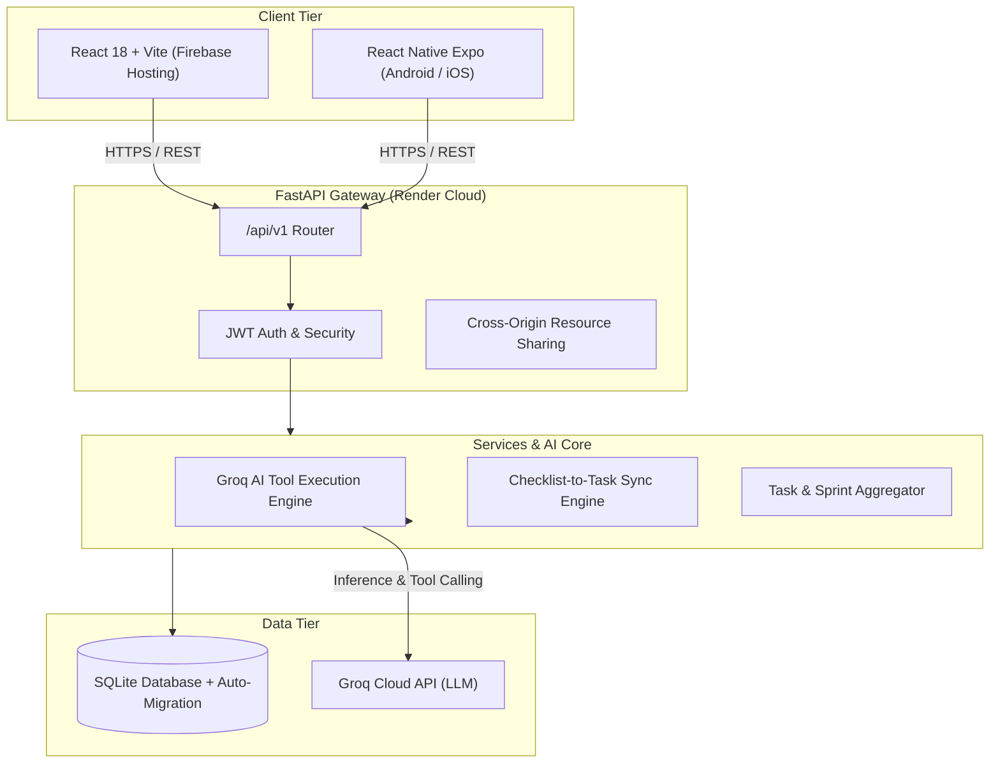

# ⚡ Kortex — Autonomous AI Developer Platform & Workspace

<div align="center">

[](https://kortex-246.web.app)
[](https://kortex-xnin.onrender.com/api/v1/health)
[](https://vitejs.dev)
[](https://groq.com)
[](LICENSE)

**An intelligent, unified engineering productivity hub combining Task Management, Agile Sprints, LaTeX/Markdown & Plain-Text Notes, and an Autonomous Groq AI Copilot with Function Calling.**

[🚀 **Explore Live App**](https://kortex-246.web.app) • [📖 **Interactive API Docs**](https://kortex-xnin.onrender.com/docs) • [📦 **GitHub Repo**](https://github.com/pranav-pushya/todo)

</div>

---

## 🌟 Key Features

### 1. 📋 Smart Task & Project Management
- **Smart Views**: Instantly triage workflows via **Inbox**, **Today**, **Upcoming**, and **Completed** filters.
- **Priority Matrix**: P1 (Urgent/Critical), P2 (High), P3 (Medium), P4 (Low) with visual indicators.
- **Project Workspaces**: Group tasks into color-coded projects with live completion statistics.
- **Productivity Analytics**: Real-time velocity tracking, streak counting, and task completion metrics.

### 2. 📝 Dual-Format Notes Workspace (Markdown & Plain Text)
- **1-Click Format Switcher**: Seamlessly toggle any note between **Markdown (`.md`)** and **Plain Text (`.txt`)** with zero data loss.
- **Live KaTeX Mathematical Formulation**: Render complex equations inline (`$E=mc^2$`) and block display (`$$\mathcal{L}_{BCE} = -\frac{1}{N}\sum...$$`).
- **Syntax-Highlighted Code Blocks**: Syntax highlighting for Python, JavaScript, TypeScript, Bash, and SQL.
- **Two-Way Synced Bridge**: Automatically converts markdown checklist items (`- [ ] Task name`) into real, actionable tasks in your Inbox with one click.
- **Task Scratchpads**: Link dedicated scratchpad notes directly to specific tasks.
- **One-Click File Export**: Download notes to disk as sanitized `.md` or `.txt` files anytime.

### 3. 🤖 Autonomous AI Copilot & Command Palette
- **Groq LLaMA / GPT-OSS Engine**: Fast natural language understanding with low-latency tool execution.
- **Function Calling & Tool Use**: AI autonomously creates tasks, manages sprint assignments, organizes projects, and queries your workspace.
- **Command Palette (`Ctrl + K` / `Cmd + K`)**: Global spotlight command palette for keyboard-first navigation and rapid prompt execution.
- **Execution Audit Trail**: Transparent history log tracking every autonomous action and parameter executed.

### 4. 🏃 Agile Sprints & Velocity Planning
- Create and track engineering sprints with start and target dates.
- Interactive status boards (Planning, Active, Completed).
- Automatically aggregates open vs completed sprint backlog items.

### 5. 👤 Developer Profile & Identity
- JWT Bearer Authentication (`/api/v1/auth`).
- Developer identity modal displaying bio, GitHub handle, role, and live productivity counters.
- Ergonomic hotkeys (`u` to open Profile, `?` for Keyboard Cheatsheet, `n` for Quick Task, `m` for Notes).

---

## 🏗️ Architecture & Tech Stack



### Technology Breakdown
- **Frontend**: React 18, Vite, Tailwind CSS, Lucide React, KaTeX, Canvas Confetti.
- **Backend**: FastAPI (Python 3.12+), SQLAlchemy 2.0, Pydantic v2, Uvicorn, Groq Python SDK.
- **Database**: SQLite with automated startup schema migrations.
- **Cloud & CI/CD**: Firebase Hosting (Global CDN), Render Cloud (Auto-deploy on push to `main`), GitHub.

---

## ⚡ Quick Start & Local Setup

### Prerequisites
- Node.js (v18 or higher) & npm
- Python (v3.10 or higher)
- Groq API Key (Obtain from [Groq Console](https://console.groq.com))

---

### 1. Clone the Repository
```bash
git clone https://github.com/pranav-pushya/todo.git
cd todo
```

---

### 2. Backend Setup

```bash
cd backend

# Create virtual environment
python -m venv .venv

# Activate virtual environment
# Windows (PowerShell):
.\.venv\Scripts\Activate.ps1
# macOS/Linux:
source .venv/bin/activate

# Install dependencies
pip install -r requirements.txt

# Configure Environment Variables
# Create a .env file in backend/ (or project root):
```

Add your keys to `backend/.env`:
```env
PROJECT_NAME="Kortex Platform"
VERSION="1.0.0"
API_V1_STR="/api/v1"
SECRET_KEY="your-super-secret-jwt-key"
GROQ_API_KEY="gsk_your_groq_api_key_here"
GROQ_MODEL="openai/gpt-oss-120b"
```

Start the FastAPI development server:
```bash
uvicorn main:app --port 8001 --host 127.0.0.1 --reload
```
API Documentation will be live at: [http://127.0.0.1:8001/docs](http://127.0.0.1:8001/docs)

---

### 3. Frontend Setup

```bash
cd ../web

# Install npm dependencies
npm install

# Start development server
npm run dev
```
Open your browser at: [http://localhost:5173/](http://localhost:5173/)

---

## ⌨️ Keyboard Shortcuts

| Shortcut | Action |
| :--- | :--- |
| <kbd>Ctrl</kbd> + <kbd>K</kbd> / <kbd>Cmd</kbd> + <kbd>K</kbd> | Open AI Command Palette / Copilot |
| <kbd>N</kbd> | Create New Task |
| <kbd>M</kbd> | Toggle Notes Workspace |
| <kbd>U</kbd> | Open Developer Profile |
| <kbd>?</kbd> | Show Keyboard Shortcuts Cheatsheet |
| <kbd>Esc</kbd> | Close active modal / Return to tasks |

---

## 📡 API Reference Overview

The API is fully documented via OpenAPI/Swagger at `/docs`. Key endpoints include:

| Method | Endpoint | Description |
| :--- | :--- | :--- |
| `GET` | `/api/v1/tasks/` | List all tasks with filter, priority, and search params |
| `POST` | `/api/v1/tasks/` | Create a new task |
| `PATCH` | `/api/v1/tasks/{id}` | Update task details or mark complete |
| `GET` | `/api/v1/notes/` | Retrieve all notes |
| `POST` | `/api/v1/notes/` | Create a new note (Markdown or Plain Text) |
| `PATCH` | `/api/v1/notes/{id}` | Update note title, content, format (`markdown`/`text`) |
| `POST` | `/api/v1/notes/{id}/sync-checklists` | Auto-sync checklist items to Inbox tasks |
| `POST` | `/api/v1/agent/command` | Dispatch natural language prompts to Groq AI |
| `POST` | `/api/v1/auth/login` | Authenticate and obtain JWT Bearer token |

---

## 🚀 Deployment

### Frontend (Firebase Hosting)
```bash
cd web
npm run build
cd ..
firebase deploy --only hosting
```

### Backend (Render Cloud)
The backend is set to continuously deploy from the `main` branch. Simply push new commits:
```bash
git push origin main
```
Render runs `uvicorn main:app --host 0.0.0.0 --port $PORT` and automatically reads configuration from Render Environment Variables.

---

## 📄 License
This project is open-source under the [MIT License](LICENSE).
