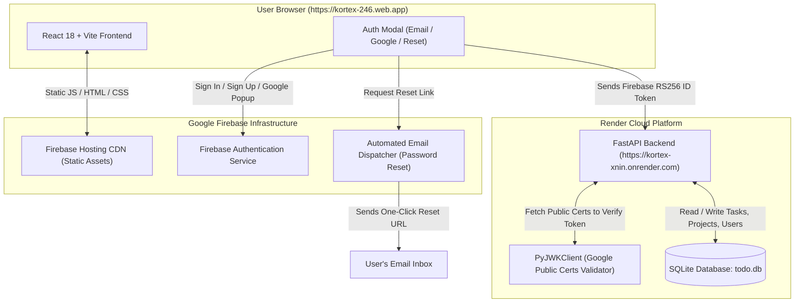

# 🔐 Authentication & Full-Stack Deployment Architecture Guide

Welcome to the comprehensive technical documentation for **Authentication and Deployment** in the **Kortex** platform. This guide covers how our hybrid authentication system operates, how Google Firebase handles authentication and automated password reset emails, how the React frontend is deployed to **Firebase Hosting**, and how the FastAPI Python backend is deployed to **Render**.

---

## 📑 Table of Contents
1. [Architecture Overview & High-Level Flow](#1-architecture-overview--high-level-flow)
2. [Authentication Architecture (Firebase + FastAPI Hybrid)](#2-authentication-architecture-firebase--fastapi-hybrid)
   - [A. Why Firebase Auth Was Chosen](#a-why-firebase-auth-was-chosen)
   - [B. Automated Password Reset Emails](#b-automated-password-reset-emails)
   - [C. Show/Hide Password Eye Button](#c-showhide-password-eye-button)
   - [D. Google 1-Click Sign-In](#d-google-1-click-sign-in)
   - [E. Backend Token Verification via Google JWKS](#e-backend-token-verification-via-google-jwks)
   - [F. SQLite User Sync & Foreign Key Relationships](#f-sqlite-user-sync--foreign-key-relationships)
3. [Frontend Deployment (Firebase Hosting)](#3-frontend-deployment-firebase-hosting)
   - [A. Firebase Hosting Configuration](#a-firebase-hosting-configuration)
   - [B. The 'Black Screen on 0.5s Refresh' Bug & Root Cause](#b-the-black-screen-on-05s-refresh-bug--root-cause)
   - [C. How the Black Screen Was Permanently Resolved](#c-how-the-black-screen-was-permanently-resolved)
   - [D. Deployment Commands & Workflow](#d-deployment-commands--workflow)
4. [Backend Deployment (Render)](#4-backend-deployment-render)
   - [A. Why Render Was Chosen for Python + SQLite](#a-why-render-was-chosen-for-python--sqlite)
   - [B. Web Service Configuration on Render](#b-web-service-configuration-on-render)
   - [C. CORS (Cross-Origin Resource Sharing) Setup](#c-cors-cross-origin-resource-sharing-setup)
   - [D. Verifying Live Endpoints & Swagger Docs](#d-verifying-live-endpoints--swagger-docs)
5. [Connecting Frontend to Production Backend](#5-connecting-frontend-to-production-backend)
6. [Troubleshooting & Verification Matrix](#6-troubleshooting--verification-matrix)

---

## 1. 🏗️ Architecture Overview & High-Level Flow

> **💡 Hinglish Summary:**  
> Ye architecture diagram dikhata hai ki kaise hamara React frontend Firebase Hosting pe chalta hai, user authentication Google Firebase handle karta hai, aur saara database aur AI agent processing Render par chal rahe FastAPI server ke zariye hota hai.



---

## 2. 🛡️ Authentication Architecture (Firebase + FastAPI Hybrid)

### A. Why Firebase Auth Was Chosen
> **💡 Hinglish Summary:**  
> Pehle ka custom auth system local database aur mock recovery codes pe dependent tha jisme real emails nahi jaate the. Firebase Auth aane se real password reset emails, 1-click Google login, aur Google-level security hamare app mein effortlessly integrate ho gayi.

In early prototypes, authentication used local password hashing (salted bcrypt) and a temporary 6-digit recovery code shown directly on the user's screen. While functional for local testing, this presented critical real-world limitations:
1. **No Real Email Dispatch**: Without configuring an external SMTP server (like SendGrid or AWS SES) with SPF, DKIM, and DMARC DNS records, local backends cannot deliver real reset emails to a user's Gmail or Outlook inbox.
2. **Brute Force Vulnerability**: DIY code generation required custom rate-limiting, IP throttling, and session invalidation rules to prevent automated guessing.
3. **No Social Providers**: Modern developers expect 1-click authentication using Google or GitHub accounts without manually typing passwords.

**The Solution**: Firebase Authentication provides Google-grade security, pre-configured email templates, auto-rotating token refresh cycles, and 1-click Google login without any server maintenance.

---

### B. Automated Password Reset Emails
> **💡 Hinglish Summary:**  
> Jab user 'Forgot password?' click karke email daalta hai, Firebase ka official mail server user ke inbox mein direct link bhejta hai. User wahan click karke bina kisi code ke naya password securely set kar sakta hai.

#### How It Works:
1. In [`web/src/components/auth/AuthModal.jsx`](file:///d:/Coding/Projects/todo/web/src/components/auth/AuthModal.jsx), when a user clicks **"Forgot password?"**, the form switches to the reset view.
2. The user enters their registered email address and clicks **"Send Password Reset Email"**.
3. The frontend triggers `sendPasswordResetEmail(auth, email)` from `firebase/auth`.
4. Google Firebase generates an encrypted, time-limited, single-use action link and emails it immediately to the recipient from `noreply@kortex-246.firebaseapp.com`.
5. The user clicks the link in their inbox, lands on Google's secure password reset page, chooses a new password, and can immediately return to the application to log in.

```javascript
// web/src/services/firebase.js
import { sendPasswordResetEmail } from 'firebase/auth';
import { auth } from './firebase';

export async function firebaseSendPasswordReset(email) {
  return sendPasswordResetEmail(auth, email);
}
```

---

### C. Show/Hide Password Eye Button
> **💡 Hinglish Summary:**  
> Saare password fields mein Lucide React ke `Eye` aur `EyeOff` icons ke saath interactive toggle button lagaya gaya hai taaki user typing ke dauran apna password dekh sake aur typo se bach sake.

#### Implementation:
- **Component**: [`web/src/components/auth/AuthModal.jsx`](file:///d:/Coding/Projects/todo/web/src/components/auth/AuthModal.jsx) and [`web/src/components/auth/UserProfileModal.jsx`](file:///d:/Coding/Projects/todo/web/src/components/auth/UserProfileModal.jsx).
- **State**: `const [showPassword, setShowPassword] = useState(false);`
- **Dynamic Input Type**: `type={showPassword ? 'text' : 'password'}`
- **Right Padding**: The input has `pr-10` so typed characters never slide underneath the eye button icon.

```jsx
<div className="relative">
  <Lock className="w-4 h-4 text-slate-500 absolute left-3.5 top-1/2 -translate-y-1/2" />
  <input
    type={showLoginPassword ? 'text' : 'password'}
    value={loginPassword}
    onChange={(e) => setLoginPassword(e.target.value)}
    placeholder="••••••••"
    className="w-full bg-obsidian-900 border border-white/[0.08] focus:border-cobalt-500 rounded-xl pl-10 pr-10 py-2 text-sm text-white placeholder-slate-500 focus:outline-none transition-colors"
    required
  />
  <button
    type="button"
    onClick={() => setShowLoginPassword((v) => !v)}
    className="absolute right-3 top-1/2 -translate-y-1/2 text-slate-500 hover:text-slate-300 transition-colors p-1"
    aria-label={showLoginPassword ? 'Hide password' : 'Show password'}
  >
    {showLoginPassword ? <EyeOff className="w-4 h-4" /> : <Eye className="w-4 h-4" />}
  </button>
</div>
```

---

### D. Google 1-Click Sign-In
> **💡 Hinglish Summary:**  
> 'Continue with Google' button click karne par Google ka OAuth popup khulta hai. Sign-in complete hone ke baad Firebase se user profile aur token milta hai jo backend database se automatically sync ho jata hai.

#### Implementation:
- Uses `signInWithPopup(auth, googleProvider)` from `firebase/auth`.
- Upon successful authentication, Firebase provides the user's `displayName`, `email`, and `photoURL`.
- The frontend immediately exchanges the Firebase ID Token with FastAPI at `/api/v1/auth/firebase-sync` so the user is provisioned in the backend database.

```javascript
// web/src/services/firebase.js
import { signInWithPopup, GoogleAuthProvider } from 'firebase/auth';

export const googleProvider = new GoogleAuthProvider();

export async function firebaseGoogleSignIn() {
  const userCredential = await signInWithPopup(auth, googleProvider);
  const idToken = await userCredential.user.getIdToken();
  return { user: userCredential.user, idToken };
}
```

---

### E. Backend Token Verification via Google JWKS
> **💡 Hinglish Summary:**  
> Frontend se aane wale Firebase ID token ko backend Google ke live public certificates ke zariye cryptographically verify karta hai. Iske liye backend ko kisi private secret key ya service account file ki zaroorat nahi padti.

Firebase ID tokens are standard asymmetric **RS256 JWTs** signed by Google's private cryptographic keys. Google publishes its public signing certificates at:
`https://www.googleapis.com/service_accounts/v1/jwk/securetoken@system.gserviceaccount.com`

Instead of downloading sensitive `serviceAccountKey.json` files to the server, our backend uses Python's `jwt.PyJWKClient` to dynamically verify incoming tokens:

```python
# backend/app/core/firebase.py
from typing import Any, Dict
import jwt
from fastapi import HTTPException, status

FIREBASE_PROJECT_ID = "kortex-246"
GOOGLE_JWKS_URL = "https://www.googleapis.com/service_accounts/v1/jwk/securetoken@system.gserviceaccount.com"

# Cache Google public keys in memory to minimize network overhead
jwk_client = jwt.PyJWKClient(GOOGLE_JWKS_URL, cache_keys=True, max_cached_keys=16)

def verify_firebase_id_token(id_token: str, project_id: str = FIREBASE_PROJECT_ID) -> Dict[str, Any]:
    try:
        signing_key = jwk_client.get_signing_key_from_jwt(id_token)
        payload = jwt.decode(
            id_token,
            signing_key.key,
            algorithms=["RS256"],
            audience=project_id,
            issuer=f"https://securetoken.google.com/{project_id}",
        )
        return payload
    except jwt.ExpiredSignatureError:
        raise HTTPException(
            status_code=status.HTTP_401_UNAUTHORIZED,
            detail="Firebase authentication token has expired. Please sign in again.",
        )
    except jwt.PyJWTError as e:
        raise HTTPException(
            status_code=status.HTTP_401_UNAUTHORIZED,
            detail=f"Invalid Firebase authentication token: {str(e)}",
        )
```

---

### F. SQLite User Sync & Foreign Key Relationships
> **💡 Hinglish Summary:**  
> Jab koi user Firebase se login karta hai, backend check karta hai ki wo pehle se database mein hai ya nahi. Agar nahi hota, toh uski `firebase_uid` ke saath ek naya SQLite user record create kar diya jata hai taaki uske tasks aur projects safe rahein.

When `/api/v1/auth/firebase-sync` receives a verified payload:
1. It queries `users` by `firebase_uid`.
2. If not found, it queries `users` by `email` (to link existing legacy accounts).
3. If still not found, it automatically provisions a new `User` record with a unique username, profile picture, and default role.
4. It issues a backend session JWT token so that all existing database queries (`Task.user_id`, `Project.user_id`, `Note.user_id`) continue to filter records by SQLite primary key `user.id`.

```python
# backend/app/crud/user.py
def sync_firebase_user(db: Session, firebase_payload: dict, ...) -> User:
    firebase_uid = firebase_payload.get("sub") or firebase_payload.get("user_id")
    email = (firebase_payload.get("email") or f"{firebase_uid}@firebase.user").lower().strip()
    
    # 1. Existing Firebase user
    user = db.query(User).filter(User.firebase_uid == firebase_uid).first()
    if user:
        return user

    # 2. Existing user by email
    user_by_email = db.query(User).filter(func.lower(User.email) == email).first()
    if user_by_email:
        user_by_email.firebase_uid = firebase_uid
        db.commit()
        return user_by_email

    # 3. Create fresh user
    new_user = User(
        email=email,
        username=generate_unique_username(db, email),
        firebase_uid=firebase_uid,
        ...
    )
    db.add(new_user)
    db.commit()
    return new_user
```

---

## 3. 🚀 Frontend Deployment (Firebase Hosting)

### A. Firebase Hosting Configuration
> **💡 Hinglish Summary:**  
> Firebase Hosting hamare React frontend ke static files (`web/dist`) ko globally superfast CDN par host karta hai. Isme SPA routing ke liye rewrites set kiye gaye hain taaki page refresh karne par 404 error na aaye.

Our project root contains two configuration files:
1. [`.firebaserc`](file:///d:/Coding/Projects/todo/.firebaserc): Links the local workspace directly to project `kortex-246`.
2. [`firebase.json`](file:///d:/Coding/Projects/todo/firebase.json): Configures the static asset directory and Single-Page Application (SPA) URL rewrites:

```json
{
  "hosting": {
    "public": "web/dist",
    "ignore": [
      "firebase.json",
      "**/.*",
      "**/node_modules/**"
    ],
    "rewrites": [
      {
        "source": "**",
        "destination": "/index.html"
      }
    ]
  }
}
```

---

### B. The 'Black Screen on 0.5s Refresh' Bug & Root Cause
> **💡 Hinglish Summary:**  
> Deployed website par aadhe second ke liye UI dikh kar screen black ho jaati thi. Reason ye tha ki Firebase Hosting ne backend API requests pe HTML page return kar diya, jisse data `null` ban gaya aur React components crash ho gaye.

#### Complete Anatomy of the Crash:
1. **The Origin**:
   - On `localhost`, Vite's dev server proxy forwarded `/api/v1` requests to port 8001.
   - On `kortex-246.web.app`, there was no backend server listening on `/api/v1`.
   - Firebase Hosting's rewrite rule (`"source": "**" -> "/index.html"`) intercepted all API calls (`/api/v1/projects`, `/api/v1/notes`) and returned the **raw HTML** of `index.html` with status `200 OK`.
2. **The Parser Failure**:
   - `api.js` received status `200 OK`. It called `JSON.parse("<!doctype html>...")`.
   - Because `<!doctype html>` is not valid JSON, the parser threw an internal syntax error which was caught, causing `request()` to return `null`.
3. **The State Cascade**:
   - In [`ProjectContext.jsx`](file:///d:/Coding/Projects/todo/web/src/context/ProjectContext.jsx): `setProjects(data)` set `projects = null`.
   - In [`NoteContext.jsx`](file:///d:/Coding/Projects/todo/web/src/context/NoteContext.jsx): `setNotes(data)` set `notes = null`.
4. **The Unhandled Crash**:
   - Inside [`Sidebar.jsx`](file:///d:/Coding/Projects/todo/web/src/components/layout/Sidebar.jsx), the code attempted to evaluate `projects.length`.
   - Because `projects` was `null`, JavaScript threw `TypeError: Cannot read properties of null (reading 'length')`.
   - Because `<ErrorBoundary>` was positioned inside the providers instead of at the root, the unhandled error unmounted the entire React component tree.
   - The user was left looking at the empty dark `body` (`bg-obsidian-900`), resulting in a **pitch-black screen**.

---

### C. How the Black Screen Was Permanently Resolved
> **💡 Hinglish Summary:**  
> Humne teen solid fixes kiye: API layer HTML responses ko reject karta hai, saare contexts state ko hamesha empty array `[]` banaye rakhte hain, aur ErrorBoundary ko app ke sabse top level par move kar diya gaya.

1. **HTML Response Rejection in [`api.js`](file:///d:/Coding/Projects/todo/web/src/services/api.js)**:
   ```javascript
   const text = await response.text();
   const contentType = response.headers.get('content-type') || '';
   const isHtml = contentType.includes('text/html') || (text && text.trim().startsWith('<'));

   if (isHtml) {
     throw new Error(
       'Backend API unavailable at this URL. Make sure the FastAPI backend is running or VITE_API_URL is configured.'
     );
   }
   ```
2. **Defensive State Guards in Contexts**:
   - [`ProjectContext.jsx`](file:///d:/Coding/Projects/todo/web/src/context/ProjectContext.jsx): `setProjects(Array.isArray(data) ? data : []);`
   - [`NoteContext.jsx`](file:///d:/Coding/Projects/todo/web/src/context/NoteContext.jsx): `setNotes(Array.isArray(data) ? data : []);`
   - [`AgentContext.jsx`](file:///d:/Coding/Projects/todo/web/src/context/AgentContext.jsx): `setLogs(Array.isArray(data) ? data : []);`
   - [`TaskContext.jsx`](file:///d:/Coding/Projects/todo/web/src/context/TaskContext.jsx): `setTasks(Array.isArray(data) ? data.map(normalizeTask) : []);`
3. **Root ErrorBoundary in [`App.jsx`](file:///d:/Coding/Projects/todo/web/src/App.jsx)**:
   - Moved `<ErrorBoundary>` to wrap around **all** context providers. If an unforeseen error ever occurs anywhere in the component lifecycle, the user receives an Obsidian-styled diagnostic card with a "Reload" button rather than a blank screen.

---

### D. Deployment Commands & Workflow
> **💡 Hinglish Summary:**  
> Frontend deploy karne ka process simple hai: pehle `npm run build` chala kar optimized bundle banate hain, fir `npx firebase deploy --only hosting` se Google CDN par publish kar dete hain.

```bash
# 1. Navigate to the web frontend directory
cd d:\Coding\Projects\todo\web

# 2. Compile and minify the production bundle (HTML, JS, CSS)
npm run build

# 3. Return to project root where firebase.json is located
cd ..

# 4. Deploy the contents of web/dist directly to Firebase CDN
npx firebase deploy --only hosting
```

---

## 4. ⚡ Backend Deployment (Render)

### A. Why Render Was Chosen for Python + SQLite
> **💡 Hinglish Summary:**  
> Render ek powerful cloud host hai jo Python FastAPI ko native support deta hai aur setup karna bohot aasan hai. Ye hamare SQLite database file aur background tasks ko effortlessly handle kar leta hai.

1. **Native Python Support**: Render automatically detects Python versions, installs `requirements.txt`, and provisions a production web environment with zero Dockerfile required.
2. **Automatic HTTPS / SSL**: Render automatically generates and renews a free TLS certificate for your public endpoint (`https://kortex-xnin.onrender.com`).
3. **GitHub Continuous Deployment**: Every time changes are pushed to `origin/main`, Render automatically triggers a zero-downtime rebuild and redeploys the service.

---

### B. Web Service Configuration on Render
> **💡 Hinglish Summary:**  
> Render dashboard par 'New Web Service' choose karke repository connect ki gayi. Root directory ko `backend` set kiya gaya aur start command mein uvicorn specify kiya gaya.

| Setting | Value Configured |
| :--- | :--- |
| **Service Name** | `kortex-xnin` |
| **Environment** | `Python 3` |
| **Region** | `Singapore` (or closest region) |
| **Branch** | `main` |
| **Root Directory** | `backend` *(Directs Render to build inside the backend folder)* |
| **Build Command** | `pip install -r requirements.txt` |
| **Start Command** | `uvicorn main:app --host 0.0.0.0 --port $PORT` |
| **Instance Type** | Free ($0/month) |

---

### C. CORS (Cross-Origin Resource Sharing) Setup
> **💡 Hinglish Summary:**  
> Browser security ke chalte backend ko batana padta hai ki kaunsi websites API call kar sakti hain. Humne backend config mein Firebase ke live domains add kiye taaki API requests block na hon.

Browsers block cross-origin HTTP requests unless the server explicitly permits the caller domain via `Access-Control-Allow-Origin`.

In [`backend/app/core/config.py`](file:///d:/Coding/Projects/todo/backend/app/core/config.py):
```python
BACKEND_CORS_ORIGINS: List[str] = [
    "http://localhost:5173",            # Vite local development
    "http://127.0.0.1:5173",           # Localhost IP
    "http://localhost:8081",            # Expo mobile app
    "https://kortex-246.web.app",       # Live Firebase production domain
    "https://kortex-246.firebaseapp.com", # Firebase fallback domain
]
```

In [`backend/main.py`](file:///d:/Coding/Projects/todo/backend/main.py):
```python
app.add_middleware(
    CORSMiddleware,
    allow_origins=settings.BACKEND_CORS_ORIGINS,
    allow_credentials=True,
    allow_methods=["*"],
    allow_headers=["*"],
)
```

---

### D. Verifying Live Endpoints & Swagger Docs
> **💡 Hinglish Summary:**  
> Deploy hote hi humne live endpoints test kiye. Health check ne `200 healthy` return kiya aur interactive Swagger docs `/docs` par live open ho gaye.

You can verify the live backend in any browser:
- **Root Status**: `https://kortex-xnin.onrender.com/` → Returns API version & welcome metadata.
- **Health Check**: `https://kortex-xnin.onrender.com/health` → Returns `{"status":"healthy","database":"connected","version":"1.0.0"}`.
- **Interactive Swagger UI**: `https://kortex-xnin.onrender.com/docs` → Full interactive REST API documentation for testing all endpoints.

---

## 5. 🔗 Connecting Frontend to Production Backend

> **💡 Hinglish Summary:**  
> Frontend ko backend ka live address dene ke liye humne `VITE_API_URL` environment variable banaya aur code mein dynamic fallback add kiya taaki app localhost aur live cloud dono par automatically sahi URL use kare.

### Implementation:
1. Created [`web/.env.production`](file:///d:/Coding/Projects/todo/web/.env.production):
   ```bash
   VITE_API_URL=https://kortex-xnin.onrender.com/api/v1
   ```
2. In [`web/src/services/api.js`](file:///d:/Coding/Projects/todo/web/src/services/api.js), added smart environment auto-detection:
   ```javascript
   const PROD_BACKEND_URL = 'https://kortex-xnin.onrender.com/api/v1';

   const API_BASE =
     import.meta.env.VITE_API_URL ||
     (typeof window !== 'undefined' &&
     (window.location.hostname.includes('web.app') || window.location.hostname.includes('firebaseapp.com'))
       ? PROD_BACKEND_URL
       : '/api/v1');
   ```

**Outcome**:
- When developing locally on `localhost:5173`, the app automatically routes requests through Vite's local proxy to `127.0.0.1:8001`.
- When deployed on `kortex-246.web.app`, the app automatically directs API requests across the internet to `https://kortex-xnin.onrender.com/api/v1`.

---

## 6. 📋 Troubleshooting & Verification Matrix

| Issue / Symptom | Possible Cause | Solution |
| :--- | :--- | :--- |
| **"Backend API unavailable at this URL"** | Backend is sleeping on Render's free tier. | Render free instances spin down after 15 mins of inactivity. The first request takes 30-40 seconds to wake up the server. |
| **CORS Error in Browser Console** | Origin domain not in `BACKEND_CORS_ORIGINS`. | Add your custom domain to `backend/app/core/config.py` and push to GitHub. |
| **Password reset email not received** | Email in spam or incorrect email entered. | Check spam/junk folder. Ensure the email address is spelled accurately in the reset modal. |
| **Google Popup closed immediately** | Browser pop-up blocker enabled. | Allow pop-ups for `kortex-246.web.app` in your browser settings. |
| **Localhost works but production doesn't** | Cached old build on CDN. | Run `npm run build` and `npx firebase deploy --only hosting` to push the newest asset hashes. |
